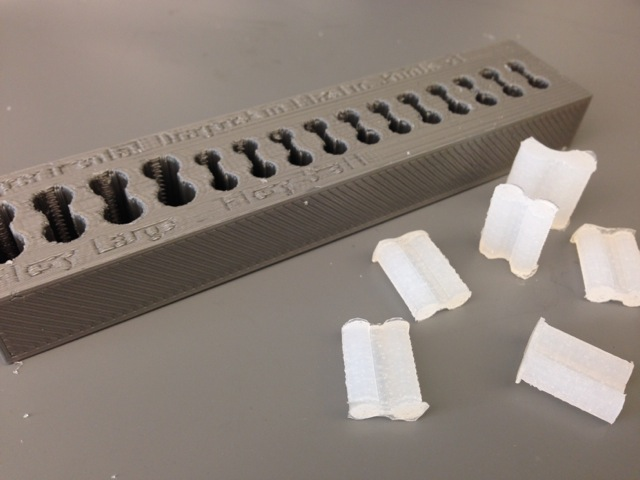

Flexy Joint
===========

3D printable mold for flexible joints of customizable size, inspired by Steve Wood's [Flexy Hand](http://www.thingiverse.com/thing:242639) and compatible with both the Flexy Hand and the [Flexy Beast prosthetic](https://github.com/daprice/Flexy-Beast). Experimental versions for different materials and hand versions can be found under [Releases](https://github.com/daprice/Flexy-Joint/releases).

For now, this is a one-piece mold and may not be compatible with some materials that are difficult to demold. It has been tested to work well with Dragon Skin silicone when printed in PLA. It may also be viable for certain urethanes when using a mold release agent.

Instructions and material information can be found [in the wiki](https://github.com/daprice/Flexy-Joint/wiki).
